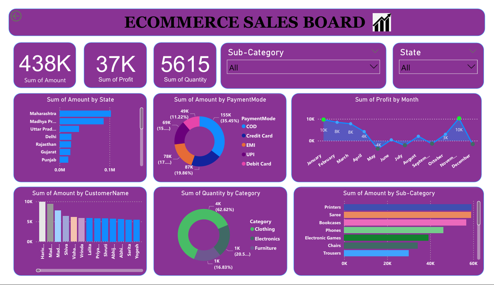

# 📊 Ecommerce Sales Dashboard (Power BI)

## 🚀 Overview

This project is an **interactive Ecommerce Sales Dashboard** built using **Power BI**.
It helps analyze sales performance across different states, categories, customers, and payment modes.

The dashboard allows users to dynamically filter data based on:

* 🗺️ **State**
* 🛍️ **Sub-Category (Store Type)**

---

## 🎯 Key Features

* 📈 **Sales Insights**

  * Total Sales Amount: **438K**
  * Total Profit: **37K**
  * Total Quantity Sold: **5615**

* 🌍 **State-wise Analysis**

  * Visual representation of sales across different states

* 💳 **Payment Mode Distribution**

  * COD, Credit Card, Debit Card, EMI, UPI

* 📅 **Monthly Profit Trends**

  * Identify peak and low-performing months

* 🛒 **Category-wise Quantity**

  * Clothing, Electronics, Furniture

* 👥 **Customer-wise Sales**

  * Top customers based on purchase amount

* 📦 **Sub-Category Analysis**

  * Products like Saree, Phones, Printers, etc.

---

## 🧠 Insights You Can Get

* Which **state generates the highest revenue**
* Which **payment method is most preferred**
* Monthly **profit fluctuations**
* Top **customers and products**
* Best performing **categories and sub-categories**

---

## 🛠️ Tools & Technologies Used

* **Power BI**
* Data Visualization Techniques
* DAX (Data Analysis Expressions)

---

## 📷 Dashboard Preview



---

## 📂 Project Structure

```
📁 Ecommerce-Sales-Dashboard
│-- 📄 README.md
│-- 📊 EcommerceDashboard.pbix
│-- 🖼️ dashboard.png
```

---

## 🎯 Use Cases

* Business Sales Analysis
* Data Visualization Practice
* Portfolio Project 

---

## ⭐ If You Like This Project

Give it a ⭐ on GitHub and share your feedback!

---

Made with ❤️ by Yatendra Gupta
